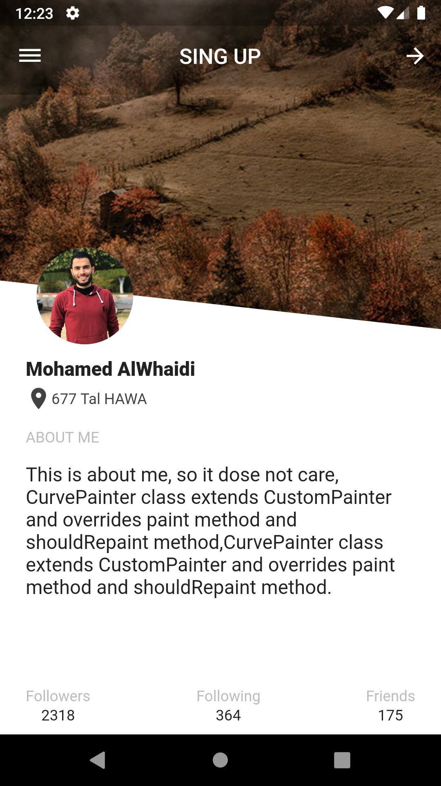
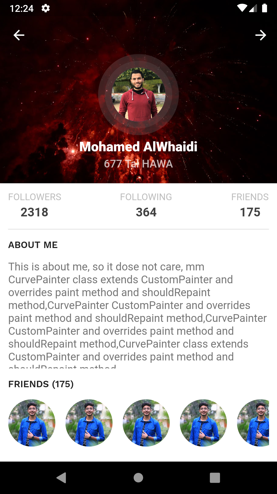
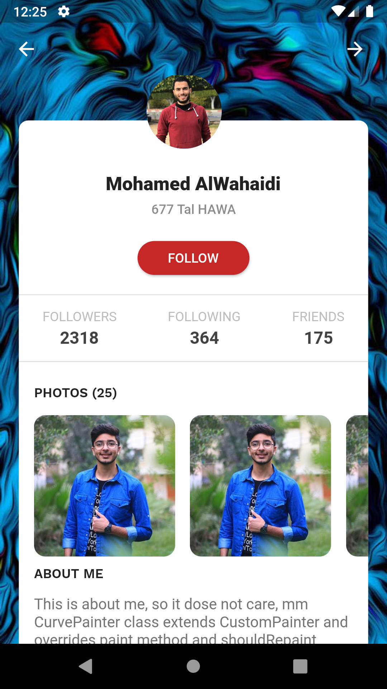
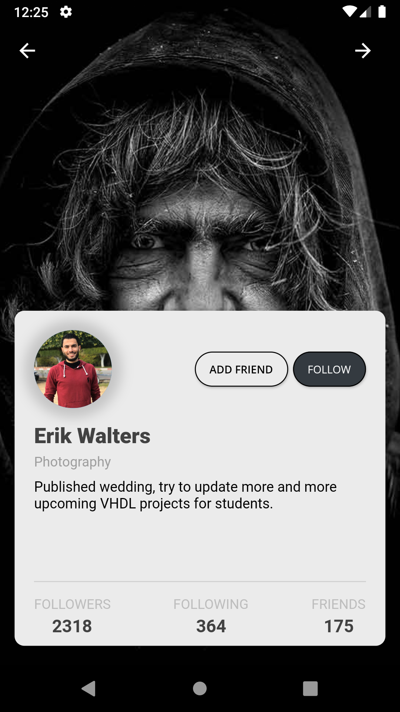
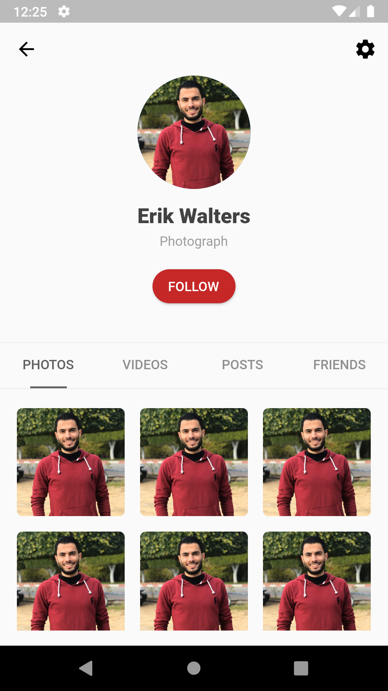

# Google Flutter UI challenges

Flutter Ui examples

  

  

  

  

  

## Mohamed AlWhaidi Flutter UI Example

This project is to show case flutter UI capabilities and show some UI coding

For help with you projects and hire our services email us on [Our Email](mailto:mohamedalwhaidi@gmail.com)